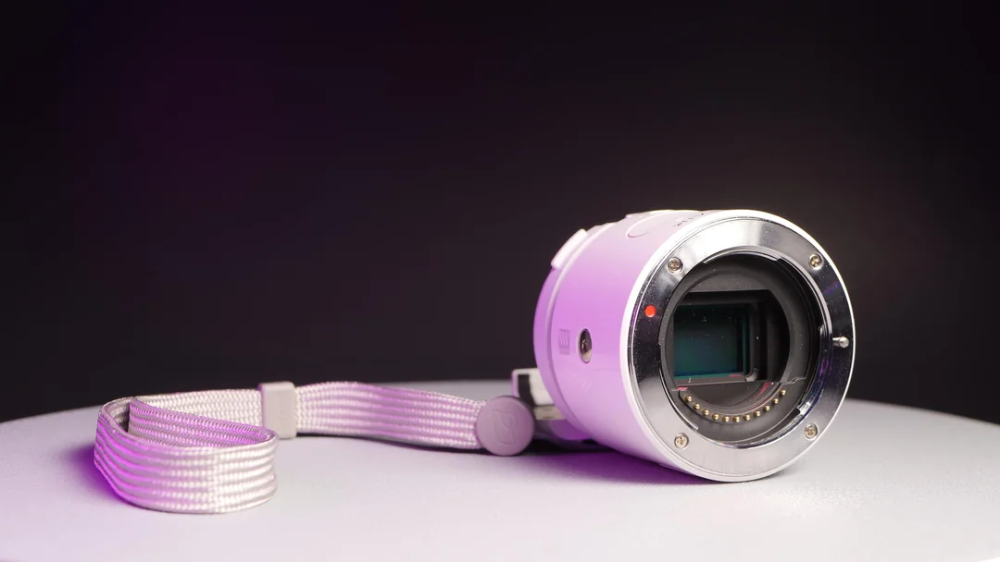
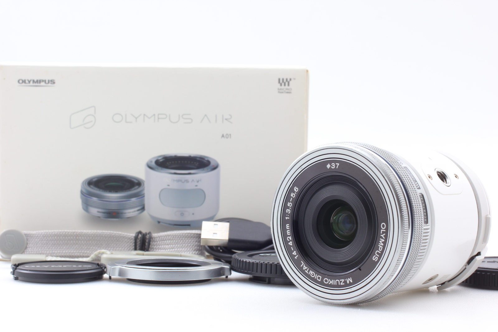

# Olympus Air Camera Terminal Viewer

A robust terminal-based application for controlling Olympus cameras over WiFi. This application provides a comprehensive suite of tools to take photos, download images, view and manage your camera remotely through an intuitive terminal interface.



[](https://youtu.be/03hyN6ijSd4?feature=shared "Control Your Olympus Air: Building a Desktop Application for Advanced Camera Control")

## Features

- Connect to Olympus cameras over WiFi with enhanced connection reliability
- Take photos with optimized warm-up sequence for better results
- Browse images stored on the camera with pagination and fast navigation
- View images directly on the camera without downloading, with multiple display methods
- Live view from Olympus Air camera with high-performance streaming
- Record live video directly from camera stream
- Download images to your computer with progress tracking
- Delete images (on supported models)
- Offline mode with robust reconnection capability
- Responsive terminal UI with intuitive navigation
- Comprehensive error handling and diagnostics

## Recent Improvements

### Modular Architecture

The codebase has been refactored into a modular, trait-based architecture that improves maintainability and extensibility:

- **Client Module**: Handles all HTTP operations with enhanced error recovery
- **Connection Module**: Manages camera connection with automatic retries and backoff
- **Image Module**: Provides robust image operations (listing, downloading, deletion)
- **Photo Module**: Controls photo capture with warm-up sequence

### Enhanced Image Viewing

Our improved image viewing system now supports multiple URL formats for maximum compatibility with different Olympus camera models:

- **Auto-detection**: Automatically detects which URL format works with your specific camera
- **Error Recovery**: Gracefully handles 404/520 errors by trying alternative formats
- **High Resolution**: Option to load higher resolution versions of images
- **Cache Management**: Efficient caching system to improve performance

### Diagnostic Tools

The application now includes powerful diagnostic capabilities:

- **API Explorer**: Systematically tests different camera endpoints to identify supported features
- **Enhanced Logging**: Comprehensive logging system with emoji indicators for better readability
- **URL Format Testing**: Tests multiple URL formats to determine what works with your camera
- **Connection Analysis**: Provides detailed information about connection quality and status

### Live View Performance

The live view streaming has been optimized for higher performance:

- **Improved Buffer Management**: Optimized buffer allocation for smoother video
- **Enhanced Frame Processing**: Better RTP protocol handling for more reliable streaming
- **Adaptive Frame Rate**: Dynamically adjusts frame processing based on system capabilities
- **Robust Error Recovery**: Automatically recovers from streaming disruptions
- **Player Integration**: Better integration with external players (MPlayer/FFplay)

## Technical Details

### Wireless Image Viewing

- **Resolution Options**: Low, medium, and high resolution options to balance quality and speed
- **Multiple Display Methods**: Support for various terminal image display methods (iTerm2, Kitty, SIXEL, etc.)
- **Zoom Functionality**: Dynamically adjust zoom level with real-time feedback
- **Cross-Platform Support**: Works on macOS, Linux, and Windows with appropriate fallbacks

### Live View and Recording

- **Stream Format**: MJPEG stream used for live viewing with optimized encoding
- **Viewer Integration**: Utilizes `mplayer` with performance-optimized parameters
- **Recording**: Optionally pipe the stream to a file for recording purposes
- **Fallbacks**: Automatic player selection with fallback options (FFplay)

## Project Structure

```
src/
├── camera/
│   ├── client/
│   │   ├── basic.rs          # Basic HTTP operations
│   │   ├── error.rs          # Error handling utilities
│   │   └── mod.rs            # Client module exports
│   ├── connection/
│   │   ├── init.rs           # Connection initialization
│   │   └── mod.rs            # Connection module exports
│   ├── image/
│   │   ├── delete.rs         # Image deletion functionality
│   │   ├── download.rs       # Image download functionality
│   │   ├── formats.rs        # URL format utilities
│   │   ├── list.rs           # Image listing functionality
│   │   └── mod.rs            # Image module exports
│   ├── mod.rs                # Camera module exports
│   ├── olympus.rs            # Main Olympus camera implementation
│   └── photo/
│       ├── capture.rs        # Photo capture functionality
│       └── mod.rs            # Photo module exports
├── main.rs                   # Program entry point
├── terminal/
│   ├── app.rs                # Main application
│   ├── handlers.rs           # Input handlers
│   ├── image_viewer/
│   │   ├── display/          # Display method implementations
│   │   ├── handlers.rs       # Image viewer input handlers
│   │   ├── mod.rs            # Image viewer module export
│   │   ├── renderer/         # Advanced rendering components
│   │   └── state.rs          # Image viewer state
│   ├── mod.rs                # Terminal module export
│   ├── renderer.rs           # UI rendering
│   ├── state.rs              # Application state
│   └── video_viewer/
│       ├── handlers.rs       # Video viewer input handlers
│       ├── mod.rs            # Video viewer module export
│       ├── olympus_udp.rs    # Optimized UDP communication
│       ├── renderer.rs       # Video viewer UI rendering
│       └── state.rs          # Video viewer state
└── utils/
    ├── logging.rs            # Enhanced logging utilities
    └── mod.rs                # Utils module export
```

## Dependencies

- `anyhow` - Comprehensive error handling
- `log` & `env_logger` - Enhanced logging system
- `reqwest` - Robust HTTP client for camera communication
- `tui` - Terminal user interface framework
- `crossterm` - Cross-platform terminal manipulation
- `colored` - Terminal color output
- `regex` - Regular expressions for parsing camera responses
- `viuer` - Terminal image display engine
- `termsize` - Terminal size detection
- `base64` - Encoding/decoding for image transfer
- `tempfile` - Temporary file handling for image preview

## Installation

1. Clone the repository:

```bash
git clone https://github.com/username/olympus-air-video.git
cd olympus-air-video
```

2. Build the project:

```bash
cargo build --release
```

## Usage

First, make sure your Olympus camera is in WiFi mode and your computer is connected to it.

### Run the app:

```bash
# Standard mode
./run.sh

# Debug mode with detailed logging
./run.sh --debug
```

### Using Image Viewer

Navigate to the "View Images" option in the main menu and press Enter to see the list of images on your camera. Select an image and press Enter to view it.

Controls:

- `+`/`-` - Zoom in/out
- `0` - Reset zoom
- `r` - Load higher resolution version
- `d` - Cycle display methods (for different terminals)
- `a` - Toggle aspect ratio preservation
- `Enter` - Display full image using external viewer
- `Esc` - Return to image list

### Using Live View

Navigate to the "Live View" option and press Enter to start the live stream.

Controls:

- Arrow keys - Navigate menu
- Enter - Select option
- `q` - Quit current mode
- Esc - Go back to previous screen

### API Exploration

In debug mode, you can use the API exploration feature to diagnose which camera endpoints and URL formats work with your specific camera model:

1. From the image list, press `a` to start API exploration
2. Check the logs to see which endpoints succeed or fail
3. Use this information to understand your camera's capabilities

## Troubleshooting

If you encounter issues with image loading (404 or 520 errors):

1. Run in debug mode: `./run.sh --debug`
2. Use the API exploration feature to determine supported endpoints
3. Check logs for successful URL formats
4. Ensure your camera's firmware is up to date

## Contributing

Contributions are welcome! Please feel free to submit a Pull Request.

## License

This project is licensed under the MIT License - see the LICENSE file for details.
